# Perfect Aim

## Règles du jeu

Perfect Aim est composé :

-   D'un plateau de jeu
-   De 2 à 4 joueurs
-   D'objets bonus et malus
-   De boules de feu

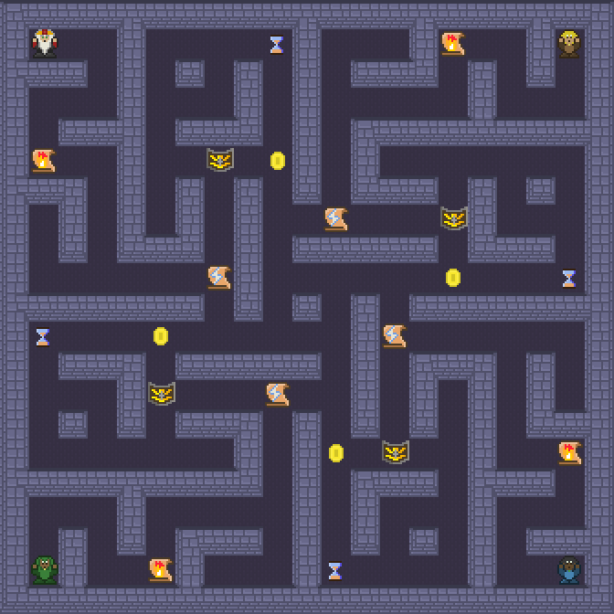

### Le plateau

Le plateau est une matrice bidimensionnelle.

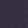 **Le sol**

Les cases vides dans lesquelles les joueurs peuvent aller.

 **Les murs**

Les cases dans lesquelles les joueurs ne peuvent pas aller.

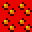 **La lave**

Les cases qui tuent tout joueur qui s'y rend.

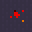 **Le sol endommagé**

Le sol qui va devenir de la lave dans les 5 secondes.

Voici un plateau de jeu avec tous ces éléments, ainsi que des objets et des joueurs :

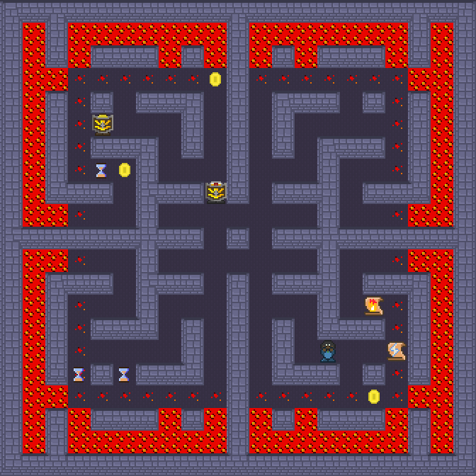

Le sol commence à s'endommager par l'extérieur à partir de 35 secondes de jeu. Toutes les 10 secondes la zone de jeu est réduite d'une case depuis tous les côtés. Tout le terrain est recouvert de lave au bout de 2 min.

Au début de la partie, le plateau est parfaitement symétrique.

### Les joueurs

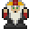 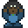 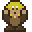 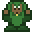

Un joueur est une entité dont les actions sont déterminées par les programmes des participants. Au début de la partie, un joueur effectue une action toutes les secondes. Cette cadence peut être accélérée ou ralentie grâce à des objets.

Une action d'un joueur est : se déplacer dans une des 4 directions, attaquer dans une des 4 directions, ou attendre sur sa case.

Deux joueurs ne peuvent pas se trouver sur la même case en même temps. Si deux joueurs essaient de se rendre sur la même case, un des deux joueurs restera immobile.

### Les objets

-   Lorsqu'un joueur se trouve sur une case contenant un objet, il le ramasse obligatoirement.
-   Des objets sont régénérés sur le plateau s'il n'y en a plus.
-   Il y a au plus un objet par case.

 **Bonus de vitesse**

Le ramasser confère un bonus de `0.25` action par seconde en plus, permanent. Les bonus et malus de vitesse sont cumulables.

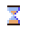 **Malus de vitesse**

Le ramasser confère un malus de `0.25` action par seconde en moins, permanent. Par conséquent, il annule un bonus de vitesse. La vitesse minimale d'un joueur est `0.5` action par seconde.

 **Pièce d'or**

Une pièce d'or, qui n'offre aucun avantage au joueur. Elles sont utilisées pour comparer deux équipes ayant un même nombre de victoires pendant le tournoi.

 **Super boule de feu**

Un sort qui permet de lancer 4 boules de feu dans toutes les directions. Ce sort est cumulable. Si un joueur possède un ou plusieurs sorts de super boule de feu, un sera obligatoirement consommé à la prochaine attaque.

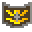 **Bouclier**

Un bouclier, qui protège de la prochaine boule de feu reçue. Non cumulable.

### Les boules de feu

L'attaque du jeu !

Voici les règles associées aux boules de feu :

-   Elles se déplacent à la vitesse de 4 cases / seconde.
-   Elles se déplacent en ligne droite jusqu'au premier mur rencontré.
-   Elles éliminent un joueur sans bouclier, et sont éliminées par un joueur avec bouclier.
-   Elles n'intéragissent pas avec les objets au sol et les autres boules de feu.
-   Deux joueurs sont susceptibles de s'entretuer s'ils s'attaquent en même temps.
-   Un joueur ne peut attaquer que s'il n'y a plus de boules de feu qu'il a envoyées sur le terrain, ou qu'il a un sort de super boule de feu.

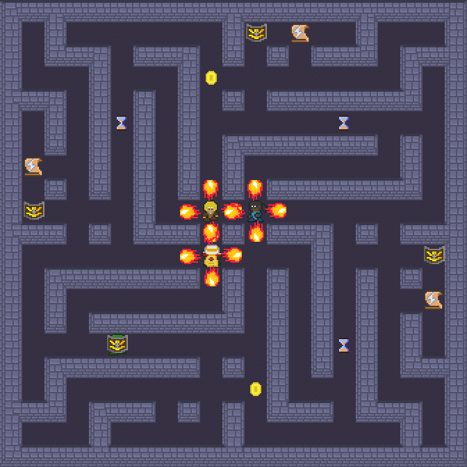

## API du jeu

Les programmes des participants sont à écrire dans le dossier `./players`. Ce dossier contient des stratégies d'exemple qui permettent d'avoir des exemples concrets de l'utilisation de l'API du jeu.

La méthode `play` est appelée à intervalle régulier pour demander au joueur quelle action jouer.

```python
class BestPlayer(Player):

    NAME = "Les Meilleurs"

    def play(self, game: Game) -> Action:
        action = Action.WAIT
        # ...votre stratégie...
        return action
```

Les paramètres d'appel sont :

-   `self` le joueur, instance de la classe `Player`.
-   `game` le jeu, instance de la classe `Game`.

Les valeurs de retour possibles sont `WAIT`, `MOVE_UP`, `MOVE_DOWN`, `MOVE_LEFT`, `MOVE_RIGHT`, `ATTACK_UP`, `ATTACK_DOWN`, `ATTACK_LEFT`, `ATTACK_RIGHT`. (À préfixer avec `Action.`.)

### Connaître l'état de son joueur

Les informations disponibles sont les suivantes :

-   `x` et `y (int)` les coordonnées du joueur, respectivement horizontale et verticale. `(0, 0)` est le mur en haut à gauche.
-   `speed (Fraction)` la vitesse du joueur, qui correspond au nombre d'actions que votre joueur effectue par seconde (`1.0` au début du jeu). Cette valeur est incrémentée de `0.25` à chaque bonus de vitesse collecté. (Et `-0.25` par malus.)
-   `coins (int)` le nombre de pièces du joueur.
-   `super_fireballs (int)` le nombre de super boules de feu collectées. La prochaine attaque en consommera une s'il y en a une disponible.
-   `shield (bool)` la présence d'un bouclier. Vrai si le joueur est protégé de la prochaine boule de feu qu'il reçoit.
-   `action (Action)` la dernière action jouée, une constante parmi les 9.
-   `color (Tile)` la couleur du joueur, une constante parmi `Tile.PLAYER_RED`, `_BLUE`, `_YELLOW`, `_GREEN`.

Par exemple :

```python
play(self, game: Game) -> Action:
    print(f"Je suis le joueur {self.color.name}")
    print(f"Je suis en (x, y) = ({self.x}, {self.y})")
    if self.shield:
        print("J'ai un bouclier !")
    if self.speed >= 2.0:
        print("J'ai ramassé 4 bonus de vitesse")
    return Action.WAIT
```

Méthodes disponibles :

-   `is_action_valid(action: Action) -> bool` : renvoie vrai si l'action est valide.
-   `can_attack() -> bool` : renvoie vrai si on peut attaquer.

```python
if self.can_attack():
    return Action.ATTACK_UP
elif self.is_action_valid(Action.MOVE_UP):
    print("Cap au Nord capitaine !")
    return Action.MOVE_UP
```

Les actions possèdent des méthodes pour les manipuler facilement :

-   `apply(coords: Tuple[int, int]) -> Tuple[int, int]` où `coords` est une paire de coordonnées : applique un déplacement aux coordonnées
-   `swap() -> Action` : donne la direction inverse
-   `to_attack() -> Action` : transforme un déplacement en attaque
-   `to_movement() -> Action` : transforme une attaque en déplacement
-   `is_attack() -> bool` : vrai si c'est une attaque
-   `is_movement() -> bool` : devine ;)

Par exemple :

```python
coords = (1, 1)
# Action.MOVE_RIGHT.apply(coords) == (1, 2)
# Action.MOVE_RIGHT.apply(Action.MOVE_RIGHT.apply(coords)) == (1, 3)

a = Action.ATTACK_UP
# a.swap() == Action.ATTACK_DOWN
# a.to_movement() == Action.MOVE_UP
# a.is_movement() == False

# a.swap().to_movement() == Action.MOVE_DOWN
#                        == a.to_movement().swap()
# a.swap().to_movement().apply(coords) == (2, 1)

```

### Connaître l'état du jeu

Le paramètre `game` est un object complexe qui représente l'état du jeu.

Valeurs simples :

-   `t (Fraction)` le temps de jeu écoulé depuis le début de la partie, en secondes.
-   `size (int)` la dimension de la grille.

On a `game.size == 21`.

#### Représentation simple

La représentation la plus simple du jeu est `tile_grid (List[List[Tile]])`. C'est une matrice bidimensionnelle de `Tile` où `Tile` est l'énumération de tous les objets du jeu possibles.

Par exemple, comme le jeu est toujours entouré d'un mur, on a `game.tile_grid[0][0] == Tile.WALL`.

```python
[[WALL,  WALL,        WALL,   WALL,   ...],
 [WALL,  PLAYER_RED,  FLOOR,  COIN,   ...],
 [WALL,  FLOOR,       WALL,   FLOOR,  ...],
 [WALL,  FLOOR,       WALL,   FLOOR,  ...],
 ...                                      ]

# Première ligne
# game.tile_grid[1] == [WALL, PLAYER_RED, FLOOR, COIN, ...]

# Accès aux cases
# game.tile_grid[0][0] == Tile.WALL
# game.tile_grid[1][1] == Tile.PLAYER_RED
# game.tile_grid[1][3] == Tile.COIN

# Point de départ du joueur bleu
# game.tile_grid[game.size - 1][game.size - 1] == Tile.PLAYER_BLUE
```

Les valeurs possibles de `Tile` sont :

-   `FLOOR` une case vide où il est possible de se rendre
-   `WALL`
-   `LAVA` une case de lave qui tue tous les joueurs y entrant
-   `DAMAGED_FLOOR` une case qui va devenir de la lave dans un futur proche (moins de 5 secondes)
-   `SPEEDBOOST`
-   `SPEEDPENALTY`
-   `COIN`
-   `SUPER_FIREBALL`
-   `SHIELD`
-   `PLAYER_RED`
-   `PLAYER_BLUE`
-   `PLAYER_YELLOW`
-   `PLAYER_GREEN`
-   `FIREBALL` une boule de feu

S'il y a une superposition (par exemple `DAMAGED_FLOOR`, `SPEEDBOOST`, `FIREBALL` sur la même case), c'est le dernier objet dans l'ordre de la liste au dessus qui est enregistré dans `tile_grid` (donc dans cet exemple `FIREBALL`).

Il existe des méthodes pour savoir rapidement si un élément de la classe `Tile` est dans une certaine catégorie :

-   `is_floor() -> bool` : `FLOOR` et `DAMAGED_FLOOR`
-   `is_background() -> bool` : `FLOOR`, `WALL`, `LAVA` et `DAMAGED_FLOOR`
-   `is_collectible() -> bool` : un des 5 objets ramassables
-   `is_bonus() -> bool` : `SPEEDBOOST`, `SUPER_FIREBALL` et `SHIELD`
-   `is_player() -> bool` : un des 4 joueurs
-   `is_dangerous() -> bool` : `LAVA`, `DAMAGED_FLOOR`, les joueurs et `FIREBALL`

Par exemple :

```python
a = Tile.FLOOR
b = Tile.SHIELD
# a.is_background() == True
# a.is_bonus()      == False
# b.is_background() == False
# b.is_bonus()      == True
```

Voici des exemples plus complets :

```python
def play(self, game: Game) -> Action:
    # ...
    if game.tile_grid[self.y][self.x + 1].is_dangerous():
        print("Je ne dois pas aller à droite, c'est dangereux !")
    # ...
```

Pour se repérer dans une matrice bidimensionnelle :

-   Au dessus : `g[y - 1][x]`.
-   En dessous : `g[y + 1][x]`.
-   À gauche : `g[y][x - 1]`.
-   À droite : `g[y][x + 1]`.

```python
def play(self, game: Game) -> Action:

    # On regarde dans les 4 directions
    for a in (Action.MOVE_UP, Action.MOVE_DOWN,
              Action.MOVE_LEFT, Action.MOVE_RIGHT):

        # La case adjacente au joueur dans la direction `a`
        coords = (self.x, self.y)
        x, y = a.apply(coords)

        # S'il y a un joueur sur cette case, on attaque dans cette direction
        if game.tile_grid[y][x].is_player():
            return a.to_attack()

    # ...
```

#### Representation complète

Pour avoir une représentation complète du jeu, il faut utiliser conjointement `background (List[List[Tile]])` et `entity_grid (List[List[Set[Entity]]])`. Ce sont deux matrices bidimensionnelles, comme `tile_grid`, mais elles permettent de connaître les éléments superposés, ainsi que des détails sur eux.

`background` est une matrice qui ne contient que des éléments du fond : `FLOOR`, `WALL`, `LAVA`, `DAMAGED_FLOOR`.

Cela permet par exemple de savoir quelle est la case sous son joueur :

```python
# tile_grid ne permet pas de savoir sur quelle case on est, car on a toujours
# game.tile_grid[self.y][self.x].is_player() == True
# car PLAYER_* est après FLOOR et DAMAGED_FLOOR dans la liste donnée plus haut
if game.background[self.y][self.x] == Tile.DAMAGED_FLOOR:
    print("Je ferais mieux d'aller ailleurs")
```

Pour connaître les entités sur un case il faut alors utiliser `entity_grid`, qui est une matrice bidimensionnelle d'ensembles d'entités. Les entités sont des sous-classes de `entities.Entity`.

L'arborescence est la suivante :

-   `Entity`
    -   `MovingEntity`
        -   `PlayerEntity`
            -   `RedPlayer`
            -   `BluePlayer`
            -   `YellowPlayer`
            -   `GreenPlayer`
        -   `Fireball`
    -   `CollectableEntity`
        -   `Coin`
        -   `SpeedBoost`
        -   `SpeedPenalty`
        -   `SuperFireball`
        -   `Shield`

Les attributs des instances de ces classes sont les suivants :

-   Toutes les entités possèdent des coordonnées `x` et `y (int)`.
-   Toutes les entités possèdent une constante `TILE (Tile)`, ce qui permet d'utiliser `TILE.is_*()` par exemple.
-   Les entités mobiles ont en plus `speed (Fraction)`, `action (Action)` et `action_progress (Fraction)`, respectivement la vitesse, l'action en cours et l'avancement de l'action en cours (entre 0 et 1).
-   Les joueurs ont en plus une couleur `color (Tile)`, une constante parmi `Tile.PLAYER_RED`, `_BLUE`, `_YELLOW`, `_GREEN`.

Par exemple, regardons à droite jusqu'au bout du couloir :

```python
# Coordonnées de la case voisine
x, y = Action.MOVE_RIGHT.apply((self.x, self.y))

# On regarde jusqu'au prochain mur
while game.background[y][x] != Tile.WALL:

    # On regarde l'ensemble des entités sur la case
    for entity in game.entity_grid[y][x]:

        # Quelques exemples
        if isinstance(entity, entities.PlayerEntity):
            # On attaque un joueur, on affiche sa couleur
            print(f"À l'attaque de {entity.color.name} !")
            return Action.ATTACK_RIGHT

        elif (
            isinstance(entity, entities.Fireball)
            # C'est une entité mobile, on peut savoir où elle va
            and entity.action == Action.MOVE_LEFT
        ):
            print("On se fait attaquer !")
            return Action.MOVE_LEFT

        elif (
            isinstance(entity, entities.CollectableEntity)
            # Est-ce que c'est un bonus ?
            and entity.TILE.is_bonus()
        ):
            print("Oh un bonus :)")
            return Action.MOVE_RIGHT

    # On va sur la case suivante
    x, y = Action.MOVE_RIGHT.apply((x, y))
```

Enfin, il est possible de parcourir l'ensemble de toutes les entités du jeu avec `game.entities (Set[Entity])` :

```python
p = 0
b = 0
for entity in game.entities:
    if isinstance(entity, entities.PlayerEntity):
        p += 1
    elif entity.TILE.is_bonus():
        b += 1
print(f"Il reste {p} joueurs et {b} bonus en jeu.")
```

### Stratégies d'exemple

Avec cette doc vous savez tout ce qu'il faut pour gagner ! Vous pouvez lire le code des stratégie d'exemple, comme `IndianaJones`, qui est une bonne base pour commencer si vous ne savez pas où aller.

## Crédits

**Code** :

-   Code du jeu par [Gautier Ben Aïm](https://github.com/GauBen), sous licence MIT
-   Code des stratégies des participants : consulter les licences dans les fichiers du dossier ./players/

**Ressources graphiques** :

-   [Instant Dungeon! v1.4 Art Pack](https://opengameart.org/content/instant-dungeon-v14-art-pack) ([Jeu d'origine](http://www.indiedb.com/games/instant-dungeon)) par Scott Matott, Voytek Falendysz et José Luis Peiró Lima, sous licence [OGA-BY-3.0](https://static.opengameart.org/OGA-BY-3.0.txt)
-   [Magma / Lava Tileset 8x8](https://opengameart.org/content/magma-lava-tileset-8x8) par GoodClover, sous licence [CC-BY-4.0](https://creativecommons.org/licenses/by/4.0/legalcode)
