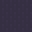

---

# Perfect Aim

---


---

## Le terrain

 Le sol

 Les murs

 La lave

 Le sol endommagé

---

## Les joueurs

   

---

## Les objets

 Bonus de vitesse

 Malus de vitesse

 Pièce d'or

 Super boule de feu

 Bouclier

---

## Les boules de feu

       

---

## L'API

```python
import random
from game import Action, Game, Player

class BestPlayer(Player):

    NAME = "1 - Les Meilleurs"

    def play(self, game: Game) -> Action:
        a = random.choice([Action.ATTACK_UP,
                           Action.MOVE_LEFT,
                           Action.WAIT])
        return a
```

---

# Le tournoi‌‌‌‌

-   _Free for all_
-   En poules successives de 3 ou 4
-   Les deux meilleurs de chaque poule sont qualifiés
-   Uniquement les victoires sont comptées
-   Ne négligez pas l'importance des pièces !

---

# Les règles

1. Un n7ien par équipe
2. Vous restez propriétaire du code, et vous pouvez choisir une licence
3. Uniquement certaines bibliothèques de la bibliothèque standard

_Consulter le fichier reglement.txt_

---

# Les lots

Offerts par notre partenaire **Capgemini** 

-   80 € pour les vainqueurs
-   40 €, 20 € et 10 € pour les finalistes
-   450 € en tout !

---

# Rendu du code

-   Testez avec 50 parties
-   Pas d'erreurs, pas de warning
-   Pas de `print`
-   Pas de boucles infinies
-   Mettre un unique fichier `.py` dans le canal texte de votre équipe, de moins de 30 kio, avant 18h40

---

# Programme du live

-   14h30 : Début du hackathon
-   18h40 : Interview de Philippe Becane,
    Directeur des Opérations à Capgemini
-   19h00 : Tournoi entre les équipes
-   20h00 : Fin de l'évènement (au plus tard)

---

# C'est parti !

git clone https://github.com/GauBen/perfect-aim.git

_(vous avez 4 heures)_
